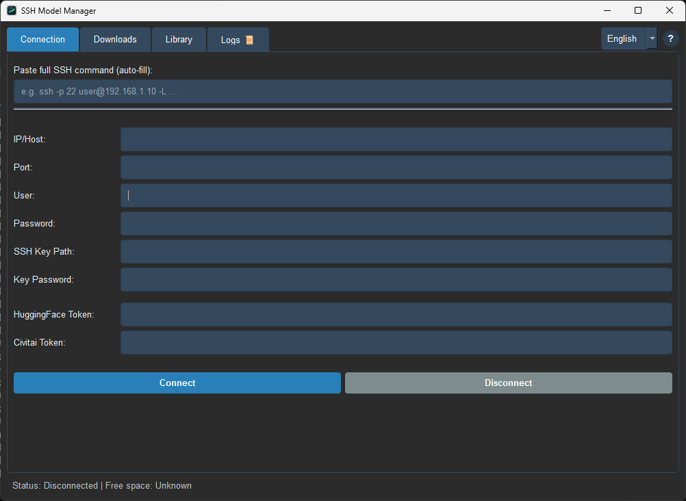
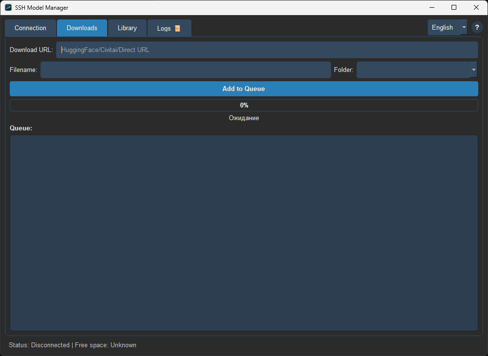
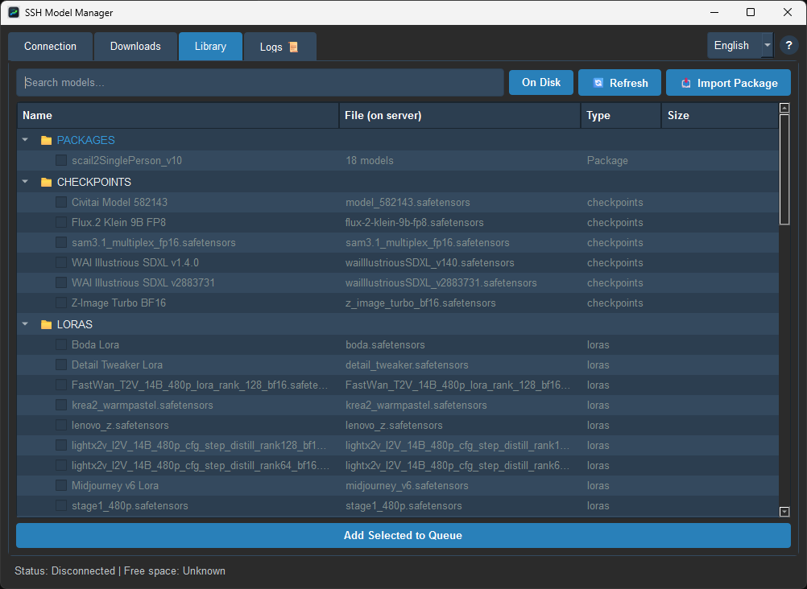

# SSH Model Manager for ComfyUI (SSH ComfyUI 模型管理器)

基于 Python 和 PyQt6 构建的的跨平台桌面应用程序，旨在管理、下载和上传远程 ComfyUI 服务器的模型。

## 为什么需要这个工具 (动机)

我编写这个应用程序是因为我厌倦了每次租用远程 GPU 服务器时都要从头开始下载所有模型。记住需要下载哪些模型、寻找它们的链接并执行终端命令是一件非常令人头疼的事情。我开发这个工具是为了将我的模型库集中在一个地方管理，并能立即与任何服务器进行同步。

希望这个应用程序能为您带来便利，节省您的时间，并帮您消除这种烦恼。

## 功能特性

- **🚀 SFTP 上传 (拖拽支持):** 只需将电脑中的任何模型文件直接拖放到应用程序窗口中，即可通过流水线式 SFTP 将其上传到您的远程服务器。
- **🔗 直链下载:** 粘贴下载链接（来自 Civitai、HuggingFace 等），应用程序将指示远程服务器直接进行下载。
- **🔑 令牌注入:** 自动将您的 HuggingFace 或 Civitai API 令牌注入到请求中，这样您就可以直接下载私有或受限模型，而无需每次都输入密钥。
- **📦 模型包:** 将多个模型分组合并为自定义的“包”。您可以将这些包导出为 `.json` 文件（例如，如果您创建了一个工作流，您可以附带此 json，以便他人轻松下载所需的一切模型），或者通过拖拽导入包以进行批量下载。
- **⚡ 后台扫描:** 应用程序每 10 秒自动扫描一次服务器的 `models` 目录，并将其与您的本地目录进行同步，检测 `.safetensors`、`.pt` 和 `.bin` 文件。
- **⏸️ 队列管理:** 按顺序下载和上传多个文件。您可以暂停、恢复和取消活动任务。取消任务会自动清除服务器上的任何未下载完成的临时碎片文件。
- **🧹 文件删除:** 从远程服务器删除文件以释放空间，同时将模型保留在本地库的目录中以供将来再次下载。
- **📥 添加到库:** 将服务器上已存在的模型文件添加到您的本地库中（可绑定自定义下载链接），以便将来快速重新下载。
- **🌍 多语言界面:** 支持 3 种语言（英文、俄文、中文）。

## 界面截图





## 准备工作

- Python 3.9+

## 安装与使用

**Windows 用户（最简便的方法）：**
1. 克隆仓库或下载 ZIP 压缩包。
2. 双击运行 `start.bat`。
   *(它会自动创建虚拟环境，安装所需依赖并启动应用程序)*

**手动安装（Linux/Mac/高级用户）：**
1. 克隆仓库：
   ```bash
   git clone https://github.com/Siruz645/SSH-Model-Manager.git
   cd SSHModelManager
   ```
2. 安装所需依赖：
   ```bash
   pip install -r requirements.txt
   ```
3. 运行应用程序：
   ```bash
   python main.py
   ```

## 使用指南

### 1. 连接
在第一个标签页中，您可以输入服务器的 SSH 凭据。您也可以快速粘贴完整的 SSH 命令（例如 `ssh root@192.168.1.10 -p 22`），相应字段将自动填写。密码字段可以留空；如果需要，您也可以指定 SSH 密钥的路径并输入密钥密码。如果您计划下载受限模型，请不要忘记输入您的 API 令牌。

### 2. 下载
在此处粘贴 URL 以启动远程下载，或从桌面拖放文件以启动 SFTP 上传。活动任务可以随时暂停或取消。

### 3. 库
查看您服务器上所有已下载或扫描到的模型。
- 勾选模型旁边的复选框，然后点击 **Create Package** 建立分组。
- 右键单击任何包以将其 **Export**（导出）为 `.json` 文件，或将其删除。
- **拖放** 以前导出的任何 `.json` 文件到窗口中，即可立即导入包并批量下载其包含的所有模型。
- **批量添加：** 在库中勾选整个包或单个文件，然后点击“Add Selected to Queue”进行批量下载。

## 使用技术
- **PyQt6**: 用于构建现代化、响应迅速的图形用户界面。
- **Paramiko**: 用于安全的 SSH 连接和流水线式 SFTP 文件传输。
- **SQLite**: 用于本地轻量化缓存您的模型库。

## 许可协议

自定义许可协议，详见 [LICENSE](LICENSE) 文件。
